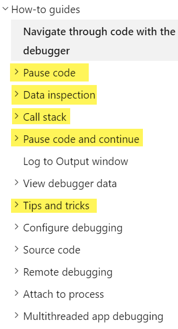

# Know Your Tools 

1. Read the following documents on using the **debugger**.
    - [**Debugging for Absolute Beginners**](https://docs.microsoft.com/en-us/visualstudio/debugger/debugging-absolute-beginners?view=vs-2019&tabs=csharp)
    - [**First look at the debugger**](https://docs.microsoft.com/en-us/visualstudio/debugger/debugger-feature-tour?view=vs-2019)
    - [**Debug a C# App**](https://docs.microsoft.com/en-us/visualstudio/debugger/quickstart-debug-with-managed?view=vs-2019)
    - [**Debug an ASP.NET Core App**](https://docs.microsoft.com/en-us/visualstudio/debugger/quickstart-debug-aspnet?view=vs-2019)
    - [**Learn to Debug C#**](https://docs.microsoft.com/en-us/visualstudio/get-started/csharp/tutorial-debugger?toc=%2Fvisualstudio%2Fdebugger%2Ftoc.json&view=vs-2019)
    - [**Navigate through Code with the Debugger**](https://docs.microsoft.com/en-us/visualstudio/debugger/navigating-through-code-with-the-debugger?view=vs-2019)
      - There are a number of other helpful articles under this MSDN topic. Check out the highlighted ones below.

        

----

