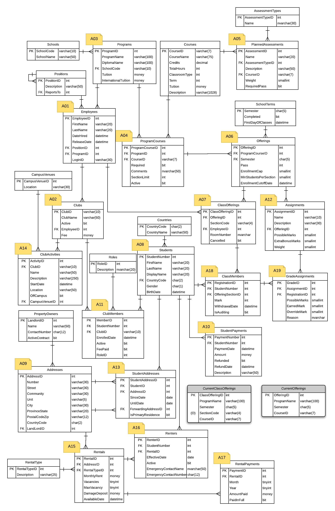

# 2022-September CPSC1517 Project Specs for Robbin Law

## Overview

This document outlines the marking guide and general requirements for the project. 

You are to create a ASP.net core 6 web app (FrontEnd using Razor Pages and BackEnd using Entity Framework) from scratch using the knowledge gained via class demos and exercises. 

You are to generate a fully-functional form on one page with two sections:

* Query – Partial Search String and Dropdown Data Lookup with Tabular Display.
* CRUD/READ – Single record Retrieve, Edit, Add, Delete.

### `Watch the recording that demonstrates the running solution for this project.`

## ERD of the StarTED Database

> ***StarTED*** Database - A database for a post-secondary school.

---
## Scenario Selection

You are expected to work on scenario [A03](A03.md) this term.

---

## The Deliverables

This project is divided into several deliverables, outlined below.

* Deliverable 1: - 4 %
  * Initial solution setup with web application and class libraries and including but not limited to: entities, DLL context, view models, extension method for dependency injection, BLL services using LINQ queries and commands, database connection, QueryCrud Page with appropriate references and navigation.
* Deliverable 2: - 15 %
  * Query Section.
* Deliverable 3: - 15 %
  * CRUD/READ Section.

> Each deliverable part is cumulative, building on previous deliverable parts of the solution. For each deliverable, any and all supporting functionality of previous deliverables must function correctly in order to gain marks for the demonstrated deliverable.
>
> Your instructor is free to make changes and/or additions to this project and its marking guide(s). ***You*** are responsible to make sure that you are up-to-date with all the changes/additions made by your instructor.
>
> ***Late projects or failure to demonstrate as required will receive a mark of zero for each affected deliverable.***
> 
> ***NOTE:** Your code **must** compile. Solutions that do not compile will receive an automatic mark of zero (0).*
----

## Generalized Marking Rubric

The following generalized marking rubric will be applied.

| Weight | Breakdown |
| ---- | --------- |
| **1** | 1 = **Proficient** (requirement is met) 0 = **Incomplete** (requirement not met) |
| **2** | 2 = **Proficient** (requirement is met) 1 = **Limited** (requirement is poorly met, minor errors) 0 = **Incomplete** (requirement not met, missing large portions) |
| **3** | 3 = **Proficient** (requirement is met) 2 = **Capable** (requirement is adequately met, minor errors) 1 = **Limited** (requirement is poorly met, major errors) 0 = **Incomplete** (requirement not met, missing large portions) |
| **4** | 4 = **Proficient** (requirement is met) 3 = **Capable** (requirement is adequately met, minor errors) 2 = **Acceptable** (requirement is partially met, minor errors) 1 = **Limited** (requirement is poorly met, major errors) 0 = **Incomplete** (requirement not met, missing large portions) |
| **5** | 5 = **Proficient** (requirement is fully met) 4 = **Capable** (requirement is adequately met, minor errors) 3 = **Acceptable** (requirement is partially met, minor errors) 2 = **Sub-Par** (requirement is partially met, significant errors) 1 = **Limited** (requirement is poorly met, major errors) 0 = **Incomplete** (requirement not met, missing large portions) |
| **10** | 10 = **Proficient** (requirement is fully met) 8 = **Capable** (requirement is adequately met, minor errors) 6 = **Acceptable** (requirement is partially met, minor errors) 4 = **Sub-Par** (requirement is partially met, significant errors) 2 = **Limited** (requirement is poorly met, major errors) 0 = **Incomplete** (requirement not met, missing large portions) |
| **15** | 15 = **Proficient** (requirement is fully met) 12 = **Capable** (requirement is adequately met, minor errors) 10 = **Acceptable** (requirement is partially met, minor errors) 8 = **Sub-Par** (requirement is partially met, significant errors) 4 = **Limited** (requirement is poorly met, major errors) 0 = **Incomplete** (requirement not met, missing large portions) |
