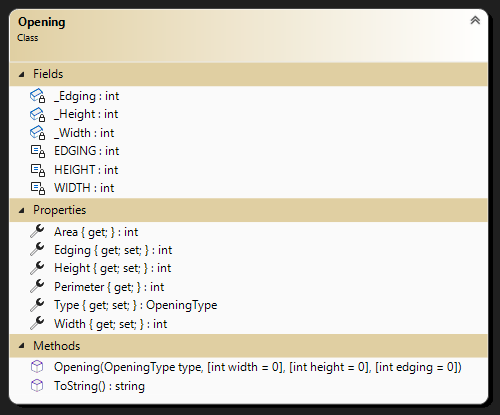
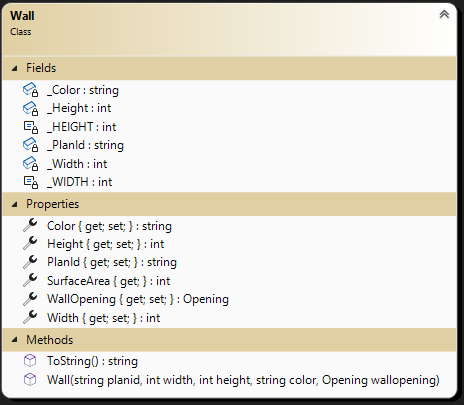
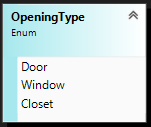
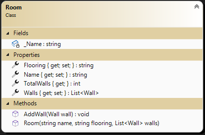
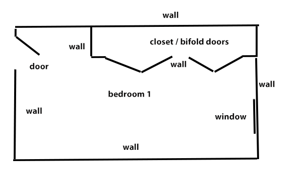

# OOP Training

> This is the first of a set of exercises that follow the evolution of a program to manage renovation projects. This set is cumulative and will build upon previous exercises.

## Overview

Your task is to generate a set of simple data types to represent the primary objects for managing renovation projects.

Create your project as a **class library** (.NET 6). You have been supplied a Unit Tests project that will inform you if your work will meet specifications. **Ensure you follow the given class diagrams for the Unit Tests to work.**

### General Validation Rules

All validation is to be performed by throwing exceptions. Here are some general requirements.

- Exceptions must have meaningful error messages with keywords (ex: positive, minimum).
- Use `ArgumentException()` for parameter value errors.
- Error messages must include details about the limits for acceptable values.
- Measurements must always be positive and non-zero numbers. Measurements are to in whole number increments (eg: 254) (all measures are in metric centimeters).
- All string information must contain text. Null, empty, and plain white-space text is not allowed. Sanitize your strings by trimming the leading and trailing whitespace.
- Use constants for minimum values.

### The `Opening`

Openings cover a variety of types such as windows, doors, panels which hide items such as entertainment electronics, and closets. The following is opening information:

- **Width** (e.g.: "110 cm") - Identifies the phyiscal size of the opening.
- **Height** (e.g: "230 cm") - Identifies the phyiscal size of the opening.
- **Edging** (e.g. "12 cm") - Identifies the width of any decorative edging.
- **Type** - Value that represents the type of this opening.
- **Area** - Value of the Opening area (width * height)
- **Perimeter** - Value of the distance around the Opening ((width + height) * 2)

Openings usually are framed but not necessarily such as basement windows. Openings width and height are the phyiscal size not the size of the item in the opening. Example, a door has a frame and the door. This is positioned within the opening and shimmed to fit correctly. Each opening may or may not have decorative edging. 

All of this must be stored as read-only information (modification of data will be done via class behaviours). You will need a greedy constructor for this class. All `set` properties must be `private`, while all getters are public; some properties only have a getter, because they calculate their values based on the state of the Opening. Create an overloaded .ToString() method for the class to display all the instance values in a comma separated value string.

Note the following:

- Minimum Width is 50 cm. 
- Minimum Height is 120 cm.
- A opening does not need an edging. Though a measurement is usually a positive non-zero value, Edging is special and can be zero (0).
- Minimum Edging if present (non-zero) is 10 cm.

  
### The `Wall`

Walls are the basic components of the house. Walls will be rectangles and have up to one opening for the purpose of this set of exercises (for simplicity). We need to track the wall's:

- **PlanId** (unique string to identify wall during renovation)
- **Width** (in centimeters e.g.: "480"), 
- **Height** (in centimeters e.g.: "240"), 
- **Color** (e.g.: Ivory White),  
- **WallOpening** (e.g.: door, window, closet), and 
- **SurfaceArea** - Value of the Wall area (width * height) minus the Opening area (if present)
  
  All of this must be stored as read-only information (modification of data will be done via class behaviours). You will need a greedy constructor for this class. All `set` properties must be `private`, while all getters are public; some properties only have a getter, because they calculate their values based on the state of the Wall. Create an overloaded .ToString() method for the class to display all the instance values in a comma separated value string.

Note the following:

- Minimum Width is 26 cm. 
- Minimum Height is 100 cm.
- The total area (width X height) of an opening in the wall must be less than 90% of the wall area. The 10% represents the need for structural framing of the openings. Have your message include `Opening limit exceeded:` along with the two area values.
- A wall does not need to have an opening (nullable instance)

### The `OpeningType`

Openings come in various structural types. Initially, we will consider only 3 types of openings: Door, Window, and Closet. Even though other common openings could be for electical outlets, light switches and recess lighting; they are not physical structural openings.

### The `Room`

A Room is a set of walls with or without openings. A Room represents an distinct area of a residence. Rooms will normally have 4 or more walls but may have as little as one wall (open layout plan). The Room must at minimum have an identifier (Name) when created. New walls are added to the room one-by-one. The collection of Walls will have a `set` property of `private` with a public getter. Create a behaviour called AddWall that will receive a wall instance to add to the Walls collection. Validate that the wall planid is unique to the wall collection. Other properties have public mutators and accessors. The Room will track:

- **Name** - This identifies the Room. Cannot not be null.
- **Flooring** - This identifies the material of the floor such as tile, carpet, hardwood, etc. Can be null.
- **Walls** - This is the collection of walls for the Room.
- **TotalWalls** - Returns the number of walls for this room in the List&lt;Wall&gt; collection.

----

## Evaluation

> ***NOTE:** Your code **must** compile. Solutions that do not compile will receive an automatic mark of zero (0).*
> 
> If you are unable to get a portion of the assignment to compile, you should:
> - Comment out the non-compiling portion of code
> - Identify the non-compiling portion in the **Incomplete Requirements** heading, noting the item's
>   - File name (e.g.: "Account.cs")
>   - Line number(s)
>   - Compiler error number and general message

Your assignment will be marked based upon the following weights.

| Earned | Weight | Deliverable/Requirement | Comments |
| ---- | ----- | --------- | ------- |
|  | 0 | Opening |   |
|  | 3 | Wall |  |
|  | 0 | OpeningType |   |
|  | 2 | Room |   |
|  | -1 | Other concerns and penalities (Unit Testing does not compile/run; commits reflect incremental development) max -1 |   |
|  | **5** | **Total ** |    |

